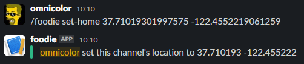
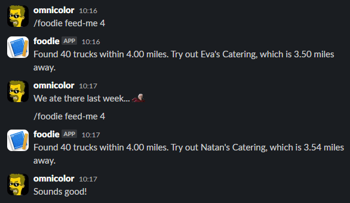

<h1 align="center">omnicolor/foodie</h1>
<p align="center">What food truck are we enjoying today?</p>

**omnicolor/foodie** is a Laravel app that stores food truck data and integrates it into a Slack bot to allow randomly choosing a nearby food truck for your team to try. Though the data source we use includes push carts, those are not included. We've all seen too many movies of high-speed chases sending a push cart flying: they're just not safe.

## Installation
After cloning the repository, install the [Composer](https://getcomposer.org) dependencies:

```bash
composer install
./artisan migrate
```

Since this project requires geospatial calculations it needs a database with those extensions, like MySQL.

This project integrates with Slack, so you'll need to [create a new Slack app](https://api.slack.com/apps). On the Basic Information page, note the `Signing Secret` and the `Verification Token`, and add those to your .env file.

Next, click on `Slash Commands` in the left navigation and create a new command. The command name will be what Slack users type to interact with this service. Naming the command `foodie` will have users type `/foodie feed-me` for example.

## Loading data
Ingesting data is done via an Artisan command:

```bash
./artisan foodie:import-food-truck-data
```
Though the data does not change that often, this script should be run on a regular basis through whatever means you schedule recurring jobs (Laravel's Scheduler, cron, or Jenkins, for example).

If you'd like to ingest data from a different provider, update the TRUCK_URI variable in your `.env` file.

## Development
All of the automated tests can be run through Composer:

```shell
$ composer all
```
If you'd like to run an individual check, composer has several scripts available:
* `coverage` - Build a [PHPUnit](https://phpunit.readthedocs.io/) code coverage report that will be available in "public/coverage-report" or on your site at "<host>/coverage-report/index.html".
* `lint` - Run [PHP-Parallel-Lint](https://github.com/php-parallel-lint/PHP-Parallel-Lint) across the entire codebase.
* `php-cs-fixer` - Run [PHP-CS-Fixer](https://github.com/PHP-CS-Fixer/PHP-CS-Fixer)'s dry run on the entire codebase.
* `phpstan` - Run [PHPstan](https://phpstan.org/)'s highest level across the entire codebase.
* `psalm` - Run [Psalm](https://psalm.dev/) across the entire codebase.
* `static` - Run lint, PHPStan, and Psalm targets.
* `style` - Run php-cs-fixer.
* `test` - Run PHPUnit tests without generating a code coverage report.

## Using Foodie

Once Foodie has been installed in your Slack team's workspace, you'll be able to interact with it via slash commands. The first step for a channel is to tell Foodie where you're located. This is stored on a per-channel basis, so geographically distributed teams can have different results for their location.

```
/foodie set-home 37.71019301997575 -122.4552219061259
```

Foodie will let you know that it has saved (or updated) the location for the channel:



After the location has been set, anyone may interact with Foodie for it to suggest a food truck within a certain radius. For example, to get a random food truck within 4 miles:

```
/foodie feed-me 4
```


